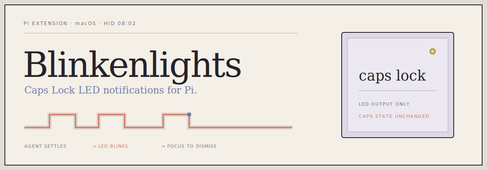

<p align="center">
  
</p>

<p align="center">
  <a href="https://pi.dev/packages"></a>
  
  <a href="LICENSE"></a>
</p>

<p align="center">
  <code>A SMALL COMPUTER COURTESY // HID LED 08:02</code>
</p>

---

Blinkenlights turns the **Caps Lock indicator LED** into a quiet, physical notification light for [Pi](https://pi.dev). Start a long task, look elsewhere, and let the keyboard blink when the agent finishes or opens a question. Return to the terminal and the light stops.

```text
[ PI:WORKING ] ──────────> [ AGENT:SETTLED ] ──────────> [ CAPS_LED:ASSERTED ]
                                                                  │
                                                   terminal focus │
                                                                  ▼
                                                         [ ACKNOWLEDGED ]
```

No cloud service. No key injection. No change to Caps Lock state.

> **Why “Blinkenlights”?** [Blinkenlights](https://en.wikipedia.org/wiki/Blinkenlights) is old hacker slang—and folklore—for the diagnostic lamps that decorated mainframes. This project keeps the affectionate part: computers are simply more charming when they can blink at you.

## Highlights

- **Glanceable alerts** — see that Pi is waiting without keeping its terminal visible.
- **Designed for many sessions** — one coordinator arbitrates every Pi project on the Mac.
- **Priority scheduling** — lower positive numbers win; equal priorities are served FIFO.
- **Expressive patterns** — use built-ins or write precise on/off phase sequences.
- **Live previews** — highlighting a pattern previews both its waveform and the real LED.
- **Global and project settings** — trusted projects can override your defaults.
- **Do Not Disturb** — pause alerts globally or per project, for a duration or indefinitely.
- **State-safe** — writes the HID LED output only; never synthesizes Caps Lock key events.

## Install

### From the Pi package gallery

```bash
pi install npm:pi-blinkenlights
```

Restart Pi or run `/reload`, then open the settings screen:

```text
/blinkenlights
```

### From GitHub

```bash
pi install git:github.com/shubhxms/pi-blinkenlights
```

### Requirements

- macOS
- [Pi](https://pi.dev)
- Xcode Command Line Tools (`xcode-select --install`)

Blinkenlights compiles its tiny native helper on first use and caches the resulting binary. Both Apple Silicon and Intel Macs are supported because the helper is built locally.

## How it behaves

Blinkenlights raises an alert when:

- the agent settles; or
- Pi opens a supported interactive question tool.

The current session acknowledges its alert when you focus the terminal, press a key, start another turn, answer the question, or shut down the session. The configured timeout is the final backstop.

### Multiple Pi sessions

Every Pi process connects to one per-user coordinator over a Unix socket. Only that coordinator controls the physical LED.

```text
 PI / PROJECT-A ──┐
 PI / PROJECT-B ──┼──[ UNIX SOCKET ]──> COORDINATOR ──> IOKIT HELPER ──> CAPS_LED
 PI / PROJECT-C ──┘          │                 │
                      alert / ack       one active signal
                      preview / DND      across all sessions
```

Scheduling is deterministic:

1. A preview temporarily wins over normal alerts.
2. The lowest positive priority number wins.
3. Equal priorities use first-in, first-out order.
4. Time keeps elapsing while an alert is preempted: `remaining = timeout − wall-clock elapsed`.
5. An alert is discarded once too little time remains for one complete pattern cycle.

## Configuration

Run `/blinkenlights` for the interactive settings menu.

| Setting | Default | Notes |
|---|---:|---|
| Enabled | `true` | May be overridden by a trusted project |
| Pattern | `Classic` | Previewed after a short highlight delay |
| Timeout | `300s` | From 1 second to 7 days |
| Priority | `10` | Positive integer; lower wins |

Built-in patterns include **Classic**, **Double pulse**, **Heartbeat**, and **SOS**.

### Custom patterns

Patterns are explicit repeating phases:

```text
on 120ms, off 80ms, on 120ms, off 700ms
```

Each phase must be between 20 ms and 60 seconds. A cycle may contain up to 64 phases and last up to 5 minutes.

### Settings files

| Scope | File |
|---|---|
| Global defaults | `~/.pi/agent/blinkenlights.json` |
| Trusted project override | `.pi/blinkenlights.json` |

Project values override global values. Pattern libraries merge, with project pattern names winning.

<details>
<summary>Example configuration</summary>

```json
{
  "enabled": true,
  "activePattern": "Double pulse",
  "timeoutSeconds": 300,
  "priority": 10,
  "patterns": {
    "Soft knock": "on 90ms, off 120ms, on 90ms, off 1200ms"
  }
}
```

</details>

## Do Not Disturb

Open the guided DND menu:

```text
/blinkenlights:dnd
```

Or set it directly:

```text
/blinkenlights:dnd global 30m
/blinkenlights:dnd project 2h
/blinkenlights:dnd project forever
/blinkenlights:dnd global off
```

Durations accept whole seconds, minutes, hours, or days (`90s`, `30m`, `2h`, `1d`). Project DND requires a trusted project. Existing matching alerts are removed immediately, and new alerts are discarded while DND is active. Explicit pattern previews still work.

## Safety and privacy

Blinkenlights talks directly to the keyboard's HID LED element (`usage page 0x08`, `usage 0x02`) through IOKit.

It does **not**:

- emit keyboard events;
- toggle or inspect Caps Lock state;
- read keystrokes;
- contact a network service; or
- attempt to control the camera privacy light.

The camera light is intentionally unsupported because macOS couples it to actual camera use. If the helper exits or is terminated, the coordinator makes a best-effort final write to switch the LED off.

## Development

```bash
git clone https://github.com/shubhxms/pi-blinkenlights.git
cd pi-blinkenlights
npm install
npm test
pi -e ./index.ts
```

The test suite covers parsing, settings precedence, DND, priority/FIFO scheduling, wall-clock decay, previews, client cancellation races, coordinator integration, strict TypeScript checks, and warning-free native compilation.

### Publishing

This repository is a Pi package and is discovered by the `pi-package` npm keyword. There is no separate pi.dev submission form.

```bash
npm login
npm pack --dry-run
npm publish --access public
```

After npm indexes the public release, it appears automatically in the [Pi package gallery](https://pi.dev/packages).

## License

[MIT](LICENSE) © Shubham Shah
