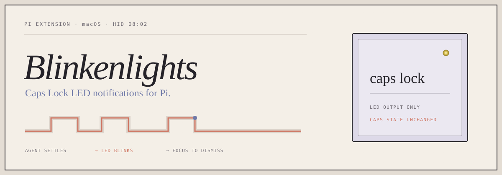

<p align="center">
  
</p>


Blinkenlights uses the **Caps Lock indicator LED** as a physical notification light for [Pi](https://pi.dev). It starts blinking when an agent finishes, and stops when you return to the terminal.

It runs locally, does not emit key events, and never changes Caps Lock state.

> **Why “Blinkenlights”?** [Blinkenlights](https://en.wikipedia.org/wiki/Blinkenlights) is old hacker slang—and folklore—for the diagnostic lamps that decorated mainframes. This project keeps the affectionate part: computers are simply more charming when they can blink at you.

## Highlights

- **Glanceable alerts** — see that Pi is waiting without keeping its terminal visible.
- **Designed for many sessions** — one coordinator arbitrates every Pi project on the Mac.
- **Priority scheduling** — lower positive numbers win; equal priorities are served FIFO.
- **Expressive patterns** — use built-ins or write precise on/off phase sequences.
- **Live previews** — highlighting a pattern previews both its waveform and the real LED.
- **Global and project settings** — trusted projects can override your defaults.
- **Do Not Disturb** — pause alerts globally or per project, for a duration or indefinitely.
- **State-safe** — writes the HID LED output only; never synthesizes Caps Lock key events.

## Install

### From the Pi package gallery

```bash
pi install npm:pi-blinkenlights
```

Restart Pi or run `/reload`, then open the settings screen:

```text
/blinkenlights
```

### From GitHub

```bash
pi install git:github.com/shubhxms/pi-blinkenlights
```

### Requirements

- macOS
- [Pi](https://pi.dev)
- Xcode Command Line Tools (`xcode-select --install`)

Blinkenlights compiles its tiny native helper on first use and caches the resulting binary. Both Apple Silicon and Intel Macs are supported because the helper is built locally.

### macOS Tahoe compatibility

On macOS Tahoe 26 and later, direct writes to the built-in keyboard's HID LED element can report success without changing the light. Blinkenlights therefore uses Tahoe's `HIDCapsLockLED` service override for the built-in keyboard, while retaining direct HID output for external keyboards and older macOS releases.

Apple does not document the Tahoe override as public API. Blinkenlights feature-detects it, restores system-managed `Auto` mode when an alert ends, and fails without touching logical Caps Lock state if the override is unavailable.

## How it behaves

Blinkenlights raises an alert when:

- the agent settles; or
- a tool named `ask_user_question`, `question`, or `questionnaire` starts.

The question-tool integration is name-based. Pi does not currently expose a generic “waiting for user input” event, so unrelated third-party tools are not detected automatically. The third-party [`@juicesharp/rpiv-ask-user-question`](https://www.npmjs.com/package/@juicesharp/rpiv-ask-user-question) package registers `ask_user_question` and works out of the box.

The current session acknowledges its alert when you focus the terminal, press a key, start another turn, answer the question, or shut down the session. The configured timeout is the final backstop.

When the terminal window is already focused, Blinkenlights suppresses the blink entirely rather than announcing something you can already see. This is configurable as **Suppress when focused** in `/blinkenlights` (on by default); turn it off if you want the LED to blink regardless.

### Focus hotkey

Blinkenlights can also jump back to the alerting Pi session. By default, double-press **Command** within 350 ms to focus the session whose alert is currently winning the coordinator schedule. You can also trigger this manually:

```text
/blinkenlights:focus
```

The hotkey is configurable from `/blinkenlights` and can be disabled.

On macOS, the hotkey helper uses a listen-only event tap. If it does not fire, allow Accessibility or Input Monitoring permission for the process macOS prompts for, then restart Pi or re-save the hotkey setting. Blinkenlights does not consume or synthesize key events.

Terminal targeting is best effort:

- tmux sessions are selected by `TMUX_PANE` first, then pane TTY, and Blinkenlights switches to the matching tmux window and pane.
- iTerm2 and Terminal.app are targeted by their AppleScript TTY metadata when available; macOS may prompt for Automation permission.
- Ghostty is activated as an app. Exact Ghostty window/tab selection is not currently available through a stable scripting API, so tmux provides the precise window/pane focus for Ghostty workflows.

### Multiple Pi sessions

Every Pi process connects to one per-user coordinator over a Unix socket. Only that coordinator controls the physical LED.

The coordinator arbitrates alerts, previews, and DND state across sessions, then starts one short-lived IOKit helper for the selected output.

Scheduling is deterministic:

1. A preview temporarily wins over normal alerts.
2. The lowest positive priority number wins.
3. Equal priorities use first-in, first-out order.
4. Time keeps elapsing while an alert is preempted: `remaining = timeout − wall-clock elapsed`.
5. An alert is discarded once too little time remains for one complete pattern cycle.

## Configuration

Run `/blinkenlights` for the interactive settings menu.

| Setting | Default | Notes |
|---|---:|---|
| Enabled | `true` | May be overridden by a trusted project |
| Pattern | `Classic` | Previewed after a short highlight delay |
| Timeout | `300s` | From 1 second to 7 days |
| Priority | `10` | Positive integer; lower wins |

Built-in patterns include **Classic**, **Double pulse**, **Heartbeat**, and **SOS**.

### Custom patterns

Patterns are explicit repeating phases:

```text
on 120ms, off 80ms, on 120ms, off 700ms
```

Each phase must be between 20 ms and 60 seconds. A cycle may contain up to 64 phases and last up to 5 minutes.

### Settings files

| Scope | File |
|---|---|
| Global defaults | `~/.pi/agent/blinkenlights.json` |
| Trusted project override | `.pi/blinkenlights.json` |

Project values override global values. Pattern libraries merge, with project pattern names winning.

<details>
<summary>Example configuration</summary>

```json
{
  "enabled": true,
  "suppressWhenFocused": true,
  "activePattern": "Double pulse",
  "timeoutSeconds": 300,
  "priority": 10,
  "patterns": {
    "Soft knock": "on 90ms, off 120ms, on 90ms, off 1200ms"
  }
}
```

</details>

## Do Not Disturb

Open the guided DND menu:

```text
/blinkenlights:dnd
```

Or set it directly:

```text
/blinkenlights:dnd global 30m
/blinkenlights:dnd project 2h
/blinkenlights:dnd project forever
/blinkenlights:dnd global off
```

Durations accept whole seconds, minutes, hours, or days (`90s`, `30m`, `2h`, `1d`). Project DND requires a trusted project. Existing matching alerts are removed immediately, and new alerts are discarded while DND is active. Explicit pattern previews still work.

## Safety and privacy

Blinkenlights uses IOKit to control only the Caps Lock indicator: the public HID LED element (`usage page 0x08`, `usage 0x02`) where it works, and Tahoe's private `HIDCapsLockLED` override for the built-in keyboard.

It does **not**:

- emit keyboard events;
- toggle or inspect Caps Lock state;
- read keystrokes;
- contact a network service; or
- attempt to control the camera privacy light.

The camera light is intentionally unsupported because macOS couples it to actual camera use. If the helper exits or is terminated, the coordinator makes a best-effort final write to switch direct HID LEDs off and restore Tahoe's system-managed `Auto` mode.

## Development

```bash
git clone https://github.com/shubhxms/pi-blinkenlights.git
cd pi-blinkenlights
npm install
npm test
pi -e ./index.ts
```

The test suite covers parsing, settings precedence, DND, priority/FIFO scheduling, wall-clock decay, previews, client cancellation races, coordinator integration, strict TypeScript checks, and warning-free native compilation.

### Publishing

This repository is a Pi package and is discovered by the `pi-package` npm keyword. There is no separate pi.dev submission form.

```bash
npm login
npm pack --dry-run
npm publish --access public
```

After npm indexes the public release, it appears automatically in the [Pi package gallery](https://pi.dev/packages).

## License

[MIT](LICENSE) © Shubham Shah
